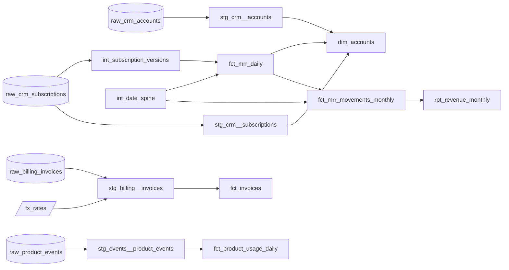

# Model lineage

```mermaid
flowchart LR
    raw_billing_invoices[(raw_billing_invoices)]
    raw_crm_accounts[(raw_crm_accounts)]
    raw_crm_subscriptions[(raw_crm_subscriptions)]
    raw_product_events[(raw_product_events)]
    dim_accounts[dim_accounts]
    fct_mrr_daily --> dim_accounts
    stg_crm__accounts --> dim_accounts
    stg_crm__subscriptions --> dim_accounts
    fct_invoices[fct_invoices]
    stg_billing__invoices --> fct_invoices
    fct_mrr_daily[fct_mrr_daily]
    int_date_spine --> fct_mrr_daily
    int_subscription_versions --> fct_mrr_daily
    fct_mrr_movements_monthly[fct_mrr_movements_monthly]
    fct_mrr_daily --> fct_mrr_movements_monthly
    int_date_spine --> fct_mrr_movements_monthly
    fct_product_usage_daily[fct_product_usage_daily]
    stg_events__product_events --> fct_product_usage_daily
    fx_rates[/fx_rates/]
    int_date_spine[int_date_spine]
    int_subscription_versions[int_subscription_versions]
    raw_crm_subscriptions --> int_subscription_versions
    rpt_revenue_monthly[rpt_revenue_monthly]
    fct_mrr_movements_monthly --> rpt_revenue_monthly
    stg_billing__invoices[stg_billing__invoices]
    raw_billing_invoices --> stg_billing__invoices
    fx_rates --> stg_billing__invoices
    stg_crm__accounts[stg_crm__accounts]
    raw_crm_accounts --> stg_crm__accounts
    stg_crm__subscriptions[stg_crm__subscriptions]
    raw_crm_subscriptions --> stg_crm__subscriptions
    stg_events__product_events[stg_events__product_events]
    raw_product_events --> stg_events__product_events
```
